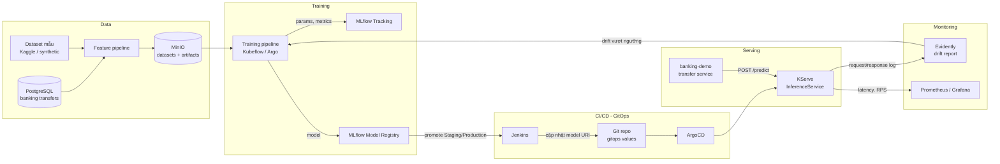

# mlops-flow — Fraud Detection MLOps trên OpenShift

Dự án học MLOps end-to-end: xây dựng mô hình **phát hiện gian lận giao dịch** cho `banking-demo`, rồi đưa nó qua đầy đủ vòng đời **data → train → registry → serving → monitoring → retrain** trên **OpenShift + ArgoCD (GitOps)**.

Dự án tái sử dụng nền tảng đã có ở `cloud-native-platform/phase9-gitops-platform` (Jenkins, Kaniko, Harbor, ArgoCD, Vault + ESO, NFS CSI) và bổ sung các thành phần đặc thù cho ML.

## 1. Mục tiêu

- Hiểu sự khác biệt giữa DevOps và MLOps: ngoài **code**, cần quản lý version cho **data** và **model**.
- Thành thạo các công cụ cốt lõi: MLflow, DVC, KServe, Kubeflow Pipelines/Argo Workflows, Evidently.
- Có một hệ thống chạy thật: service `transfer` của `banking-demo` gọi API chấm điểm gian lận trước khi chuyển tiền.

## 2. Kiến trúc tổng quan



## 3. Tech stack

| Lớp | Công cụ |
|-----|---------|
| Ngôn ngữ, ML | Python 3.11, pandas, scikit-learn, XGBoost |
| Data versioning | DVC (remote: MinIO S3) |
| Experiment tracking, registry | MLflow (backend PostgreSQL, artifact MinIO) |
| Pipeline | Kubeflow Pipelines hoặc Argo Workflows |
| Serving | KServe (chế độ RawDeployment, không cần Knative) |
| CI | Jenkins + Kaniko → Harbor (dùng lại từ phase9) |
| CD | ArgoCD App of Apps (dùng lại từ phase9) |
| Secrets | Vault + External Secrets Operator |
| Monitoring | Evidently AI, Prometheus, Grafana |

## 4. Roadmap theo phase

Mỗi phase là một thư mục riêng, học xong phase trước mới sang phase sau.

| Phase | Nội dung | Kết quả đầu ra |
|-------|----------|----------------|
| 0 | Nền tảng ML | Notebook EDA + model baseline |
| 1 | Đóng gói code ML | Project Python có cấu trúc, test, chạy được bằng CLI |
| 2 | Experiment tracking và data versioning | MLflow + DVC chạy local bằng Docker Compose |
| 3 | Model serving | API FastAPI/BentoML, Docker image |
| 4 | Hạ tầng MLOps trên OpenShift | MinIO, MLflow, KServe deploy bằng ArgoCD |
| 5 | Training pipeline | Pipeline train tự động trên cluster |
| 6 | CI/CD cho model | Promote model trong registry → tự deploy qua GitOps |
| 7 | Tích hợp banking-demo | Service `transfer` gọi fraud-scoring API |
| 8 | Monitoring và retrain | Drift report, alert, retrain tự động |

### Phase 0 — Nền tảng ML

- Dataset: [Credit Card Fraud Detection (Kaggle)](https://www.kaggle.com/datasets/mlg-ulb/creditcardfraud) hoặc dữ liệu giao dịch synthetic sinh từ schema `transfers` của `banking-demo`.
- EDA: phân phối dữ liệu, mất cân bằng lớp (fraud thường dưới 1%).
- Model baseline: Logistic Regression, Random Forest, XGBoost.
- Metric phù hợp với dữ liệu mất cân bằng: **precision, recall, F1, PR-AUC** (không dùng accuracy).

### Phase 1 — Đóng gói code ML

- Chuyển notebook thành package Python: `data/`, `features/`, `train/`, `evaluate/`.
- Quản lý config bằng YAML (hyperparameter, đường dẫn data).
- Unit test cho feature engineering, kiểm tra data schema.
- Dockerfile cho bước training.

### Phase 2 — Experiment tracking và data versioning

- `docker compose`: MLflow + PostgreSQL + MinIO.
- Log params, metrics, artifact vào MLflow; so sánh các lần chạy trên UI.
- Đăng ký model vào **MLflow Model Registry** (alias `staging`, `production`).
- DVC: version dataset, `dvc.yaml` định nghĩa pipeline `prepare → train → evaluate`.

### Phase 3 — Model serving

- API `POST /predict` bằng FastAPI, load model từ MLflow Registry.
- Validate input bằng Pydantic, trả về `fraud_probability` và `is_fraud`.
- Load test với `locust` hoặc `k6`, đo độ trễ p95.

### Phase 4 — Hạ tầng MLOps trên OpenShift

- Namespace `mlops`, AppProject riêng trong ArgoCD.
- MinIO (StorageClass `nfs-csi`), MLflow (backend PostgreSQL), KServe controller.
- Secrets MinIO/PostgreSQL lấy từ Vault qua ESO.
- Route cho MLflow UI và MinIO console.
- Lưu ý OpenShift: SCC cho các pod chạy non-root, kiểm tra image có chạy được với UID ngẫu nhiên.

### Phase 5 — Training pipeline

- Pipeline: `extract data → validate → train → evaluate → register`.
- Chỉ register model khi metric vượt ngưỡng (ví dụ PR-AUC tốt hơn model `production` hiện tại).
- Chạy theo lịch (CronWorkflow) hoặc kích hoạt thủ công.

### Phase 6 — CI/CD cho model

- **CI code**: Jenkins chạy lint, test, build image training/serving → Harbor.
- **CD model**: khi model được gán alias `production`, Jenkins cập nhật `storageUri` của InferenceService trong repo GitOps → ArgoCD sync.
- Canary rollout: KServe chia traffic giữa model cũ và mới.

### Phase 7 — Tích hợp banking-demo

- Service `transfer` gọi fraud-scoring API trước khi thực hiện chuyển tiền.
- Chính sách: chặn, yêu cầu xác thực thêm, hoặc chỉ ghi log tùy theo `fraud_probability`.
- Timeout và fallback khi model không phản hồi (không được làm hỏng luồng chuyển tiền).

### Phase 8 — Monitoring và retrain

- Log request/response của model vào MinIO hoặc PostgreSQL.
- Evidently: báo cáo **data drift** và **prediction drift** định kỳ.
- Metrics serving (latency, RPS, lỗi) lên Prometheus/Grafana.
- Drift vượt ngưỡng → alert → kích hoạt training pipeline ở Phase 5.

## 5. Cấu trúc thư mục dự kiến

```
mlops-flow/
├── phase0-ml-foundation/        # notebook EDA, baseline
├── phase1-ml-project/           # package Python, test, Dockerfile
├── phase2-tracking-versioning/  # MLflow + DVC + docker-compose
├── phase3-model-serving/        # FastAPI / BentoML
├── phase4-ocp-platform/         # manifest ArgoCD: MinIO, MLflow, KServe
├── phase5-training-pipeline/    # Kubeflow / Argo Workflows
├── phase6-model-cicd/           # Jenkinsfile, GitOps values
├── phase7-banking-integration/  # tích hợp service transfer
└── phase8-monitoring-retrain/   # Evidently, dashboard, alert
```

## 6. Tài liệu tham khảo

- [MLOps Zoomcamp — DataTalks.Club](https://github.com/DataTalksClub/mlops-zoomcamp)
- [Made With ML](https://madewithml.com/)
- *Designing Machine Learning Systems* — Chip Huyen
- [MLflow Docs](https://mlflow.org/docs/latest/index.html)
- [KServe Docs](https://kserve.github.io/website/)
- [Evidently Docs](https://docs.evidentlyai.com/)
